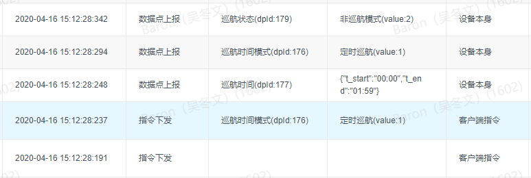

# PTZ功能开发

# 准备工作
* 在iot平台对应的pid中增加以下dp点

  

# 1、 ptz控制功能开发
* 标准dp点是119，标识符是ptz_control，类型：可上报

* 开发流程：
1、 涂鸦SDK中已经有实现关于TUYA_DP_PTZ_CONTROL这个dp点的流程代码，只需要开发者实现摇头机的方向控制
2、 根据服务器下发的 dp 点值控制设备方向，控制逻辑：
   0-up, 1-upper right, 2-right, 3-lower right, 4-down, 5-down left, 6-left, 7-top left
  
  

# 2、收藏点开发
* 说明：  
  1、dp点是178，标识符是memory_point_set，数据格式是： { "type": 1, //type表示操作类型 1 添加收藏点，2删除收藏点 ，3 跳转到具体的收藏点。 "data": { "name": "xxx" // 收藏点名称，添加的时候传 "seq": 1, //删除以及添加的时候传入 "pan": 3456, //删除以及添加的时候传入 "tilt": 234, //删除以及添加的时候传入 "zoom": 899 //删除以及添加的时候传入 } }   
  2、ptz数据的管控是由SDK管控的，ptz数据 的定义是设备端上报的，收藏点最大只能设置6个

* 开发流程：   
  1、 添加收藏点：  
  当收到app下发的178dp点，解析type为1时，调用tuya_ipc_preset_add添加收藏点，成功后再上报收藏点添加成功(dp 点178 type1    添加成功{\\\"type\\\":1,\\\"data\\\":{\\\"time\\\":utc时间}})，上报再调用tuya_ipc_preset_add_pic上报这个收藏点的当前的抓图，再上报图片上报成功(dp 点178 type4    正常添加图片成功{\\\"type\\\":4,\\\"data\\\":{\\\"time\\\":utc时间}})，如果添加失败则需上报失败(dp 点178  type：1   error_num:10001,表示增加满   {\\\"type\\\":1,\\\"data\\\":{\\\"error\\\":10001}})  

  

  2、删除收藏点：  
  当收到app下发的178dp点，解析type为2时，调用tuya_ipc_preset_del删除收藏点，删除成功上报(dp 点178  type 2   删除成功  {\\\"type\\\":2,\\\"data\\\":{\\\"error\\\":0}}   and   {\\\"type\\\":2,\\\"data\\\":{\\\"error\\\":1}}  交替发送，因为dp上报相同消息会被过滤，这里0，1交替成功上传);删除失败上报(dp 点178  type 2   删除失败  {\\\"type\\\":2,\\\"data\\\":{\\\"error\\\":10001}})  

  

  

  

  

  3、跳转收藏点：  
  当收到app下发的178dp点，解析type为3时，用户自己实现跳转mpId对应的ptz位置然后上报调用成功(dp 点178  type 3  调用成功 {\\\"type\\\":%d,\\\"data\\\":{\\\"error\\\":utc时间}}    因为dp上报相同消息会被过滤，这里上传时间戳)   

  

  4、上电和云端同步收藏点:  
  上电后调用tuya_ipc_preset_get 与服务器同步已存在的预设位收藏点信息  
  
  注意：string类型数据组合的时候双引号前加三个反斜杠

# 3、巡航功能开发  
* 说明：巡航包括两种模式：全景巡航和收藏点巡航  

* 开发流程：  

  1、app打开巡航开关，选择全景巡航或者收藏点巡航，设备端上报如下：  

  全景巡航:  

    

  收藏点巡航：

    

  巡航关闭：

    

  设置巡航时间-定时巡航：上报的时间为00:00格式，组合数据的时候注意双引号前加三个反斜杠，当当前时间没有在设定的时间区间时则还需要上报当前的非巡航模式的状态，如果当前时间在设定的时间内，则上报当前选择的巡航模式  

    

  设置巡航时间-全天巡航：上报巡航时间模式后再上报当前选择的巡航模式  

    

  

  

